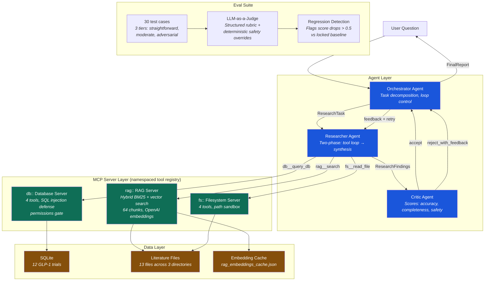

# Claude Architect

A production-grade GLP-1 clinical research agent built as part of the **Claude Certified Architect** curriculum. Every phase is built from scratch — no frameworks, no pre-built agents, no tutorials. Built in public on X ([@__mujeeb__](https://x.com/__mujeeb__)).

## What This Is

A multi-agent system that answers clinical research questions about GLP-1 receptor agonists by querying a real SQLite database, searching indexed literature via hybrid RAG, and reading verified literature files through MCP. Three agents with circuit breakers, Zod-validated inter-agent messages, and an eval suite that catches regressions before they reach production.

## Architecture



**Circuit breakers:** Researcher max 20 tool calls → synthesis. Orchestrator max 3 Researcher-Critic iterations → partial result. Safety score ≤ 2 → immediate escalation.

**Inter-agent messages:** Every message crossing an agent boundary is Zod-validated. `ResearchTask`, `ResearchFindings`, `CriticEvaluation`, `FinalReport` — schema mismatch fails loudly at the boundary, not silently downstream.

## Build Status

| Phase | Focus | Status |
|-------|-------|--------|
| Phase 1 | API client, caching, batching, streaming, usage ledger | ✅ Complete |
| Phase 2 | Prompt library, Zod schemas, validator, regression tests | ✅ Complete |
| Phase 3 | MCP servers (database + filesystem), multi-server client | ✅ Complete |
| Phase 4 | Multi-agent system with circuit breakers | ✅ Complete |
| Phase 5 | Claude Code configuration — CLAUDE.md, hooks, slash commands | ✅ Complete |
| Phase 6 | Eval suite + cost architecture | ✅ Complete |
| Phase 7 | RAG MCP server — hybrid BM25 + vector search | ✅ Complete |

## Eval Results

30 test cases across 3 tiers. LLM-as-a-Judge with structured rubric and deterministic safety overrides.

| Metric | Score |
|--------|-------|
| **Overall mean** | **4.49 / 5** |
| Correctness | 4.30 / 5 |
| Completeness | 4.83 / 5 |
| Safety | 4.33 / 5 |
| **Pass rate** | **30 / 30** |

Worst-performing cases are straightforward questions where the agent's data sources have gaps in trial-specific adverse event percentages — real data gaps, not agent failures. The eval suite correctly identifies these as the improvement targets.

## Stack

- **Language**: TypeScript, CommonJS
- **Validation**: Zod — runtime schema enforcement on all agent outputs and inter-agent messages
- **Database**: SQLite — 12 seeded GLP-1 trials with full outcomes data
- **MCP**: Three custom servers (database + filesystem + RAG) with namespaced tool registry
- **RAG**: Hybrid BM25 + cosine similarity search, OpenAI `text-embedding-3-small` embeddings, reciprocal rank fusion
- **Models**: Haiku (routing/extraction) · Sonnet (researcher/critic/synthesis/eval judge)
- **Eval**: LLM-as-a-Judge with structured rubric, regression detection, versioned runs
- **Tools**: Claude Code — built with AI assistance, every decision understood and defensible

## Key Design Decisions

**Why schema validation on every inter-agent message?**
Every message that crosses an agent boundary is validated with Zod before the next agent sees it. If the Researcher returns strings where the Critic expects arrays, the system fails loudly at the boundary — not silently three steps later. This is the primary circuit breaker against cascading failures.

**Why versioned prompt files?**
Every prompt lives in a JSON file with semver versioning. The regression test runs all versions against the live API after every change. Schema drift gets caught before it reaches production.

**Why a two-phase Researcher pattern?**
A model in tool-calling mode never cleanly transitions to synthesis — it keeps calling tools. The solution: run the tool loop until `end_turn`, collect all tool results, then make a clean synthesis call with `tool_choice: none`. Gathering and synthesis are architecturally separate.

**Why Sonnet for Researcher and Critic, not Haiku?**
Haiku lacks the judgment to know when it has gathered enough data — it over-calls tools until hitting the limit. The Critic needs clinical judgment to evaluate whether safety signals were appropriately flagged. Both require Sonnet. Tested during Phase 4 — Haiku caused infinite tool loops.

**Why MCP instead of direct database/file access in agent code?**
MCP enforces a clean separation between data access and agent logic. The database server has SQL injection defense and a `--allow-writes` permissions gate. The filesystem server sandboxes all paths. These security boundaries can't be bypassed by the agent — they're enforced at the transport layer.

**Why hybrid RAG instead of just reading files?**
For 13 files, manual reading works. For 1,300 it breaks — the agent hits the context limit before it starts answering. RAG inverts the approach: search first, read only what matches. BM25 catches exact clinical terms ("HR 0.74", "retinopathy"). Vector search catches semantic matches ("heart disease outcomes" when the query says "cardiovascular results"). Reciprocal rank fusion combines both ranked lists without needing to normalise scores.

**Why deterministic safety overrides in the eval judge?**
LLM judges can be fooled by confident, well-written responses that miss critical safety signals. If a SUSTAIN-6 response never mentions retinopathy, the judge might still score safety 4/5 because other safety considerations are discussed well. The deterministic override says: if retinopathy is required and missing, deduct 2 points regardless of what the judge said. Same principle as hooks vs prompts — deterministic rules for non-negotiable requirements.

## Running the System

```bash
npm install
npx tsc

# Run the full research agent
node dist/src/agents/test_agents.js

# Run prompt regression tests
node dist/src/prompt_library/tests/run_prompt_regression.js

# Run eval suite (5 sample cases)
node dist/evals/run_evals.js

# Run full eval suite (30 cases, ~95 minutes)
node dist/evals/run_evals.js --all

# Run single eval case with debug output
node dist/evals/run_evals.js --case=t28 --debug
```

Sample output:
```
[RAG] Chunking literature files...
[RAG] 64 chunks from 13 files
[RAG] Building BM25 index...
[RAG] Loading embeddings from cache...
[RAG] Loaded 64 cached embeddings.
[RAG] Index ready.
Connected. Tool registry: db__list_tables, db__describe_table, db__query_db,
  db__insert_record, fs__read_file, fs__write_file, fs__list_directory,
  fs__search_files, rag__search, rag__get_sources

Orchestrator starting: "What does the evidence show about semaglutide CV outcomes?"
[Iteration 1/3]
  → Running Researcher...
  ✓ Researcher complete. Confidence: high
    Trials: SUSTAIN-6, PIONEER-6, SELECT, FLOW
  → Running Critic...
  ✓ Critic decision: accept
    Scores — Accuracy: 5/5, Completeness: 5/5, Safety: 5/5
  ✓ Accepted — compiling final report
Status: complete | Evidence strength: strong
```

## Project Structure

```
src/
  api_client/         # AnthropicClient wrapper — caching, streaming, batching, usage ledger
  prompt_library/     # Versioned JSON prompts, Zod schemas, regression tests
  mcp_servers/
    database/         # SQLite MCP server — 4 tools, 2 resources, 1 prompt, SQL injection defense
    filesystem/       # Literature MCP server — 4 tools, path sandbox security
    rag/              # RAG MCP server — hybrid BM25 + vector search, embedding cache
  mcp_client/         # Multi-server client — namespaced tool registry (db::, fs::, rag::), audit logging
  agents/             # Orchestrator, Researcher, Critic — circuit breakers, Zod validation
evals/
  dataset.jsonl       # 30 test cases — 10 straightforward, 10 moderate, 10 adversarial
  judge.ts            # LLM-as-a-Judge — structured rubric, string coercion, deterministic safety overrides
  run_evals.ts        # Regression detection, versioned runs, per-case timing with ETA
  runs/               # Timestamped results from every eval run
  baseline.json       # Locked reference — regression detected = build fails
literature/
  glp1/               # 7 trial summaries (SUSTAIN-6, SELECT, LEADER, STEP-1, FLOW, SURPASS-CVOT, STEP-HFpEF)
  mechanisms/         # 3 mechanism files (receptor, cardiovascular, weight loss)
  safety/             # 3 safety files (GI events, pancreatitis, thyroid)
COST_ARCHITECTURE.md  # Cost analysis with real usage data — model selection, caching, scaling projections
.claude/
  CLAUDE.md           # Project context — architecture decisions, key commands
  commands/           # Custom slash commands: /review, /cost-check, /agent-run
  settings.json       # Hooks — file protection (PreToolUse), bash audit (PostToolUse)
```

## Cost Architecture

Real usage data from the Anthropic dashboard (March 2026): $15.31 total spend across ~35 research queries. $0.44 per query average using Sonnet exclusively, with zero caching.

Key findings from [COST_ARCHITECTURE.md](./COST_ARCHITECTURE.md):
- Output tokens are 14% of volume but 43% of cost ($15/MTok vs $3/MTok) — output verbosity reduction is the highest-leverage optimisation
- BP1 caching on system prompt + tools would save 78% on those tokens ($4,900/month at 10k users)
- Token compounding in multi-iteration loops is the hidden cost multiplier — circuit breakers are cost containment, not just quality control
- Post-RAG, most queries resolve in 1 Critic iteration instead of 1.8 average, cutting per-query cost significantly

## Domain

All literature files sourced from published peer-reviewed data. Ground truth validated against primary publications. Database covers: SUSTAIN-6, SELECT, PIONEER-6, LEADER, SURPASS-CVOT, STEP-1, STEP-HFpEF, FLOW, EMPA-KIDNEY, SURMOUNT-1, AWARD-11, ELIXA.

---

*Built with Claude Code and the Anthropic API. Building in public — updates after each phase.*